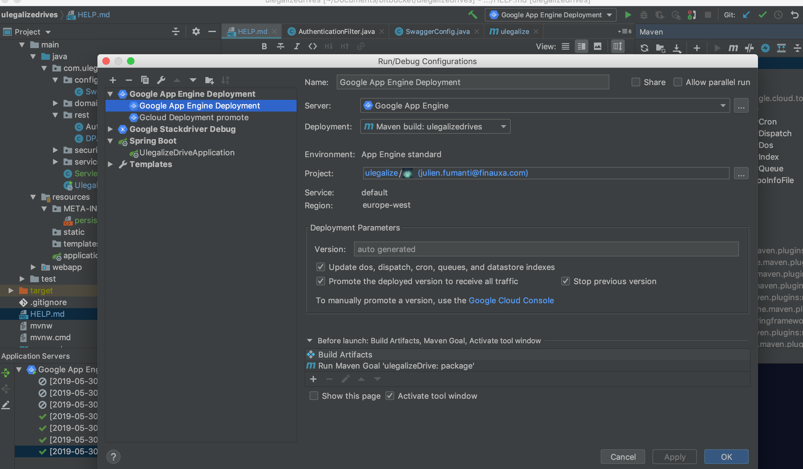

# Getting Started

#### Terminal

## V2

change `gradle.properties` version  
commit your change add a new tag and push all
```
git tag 3.2.1  
git push origin 3.2.1
```

#### DEV

run gradle to deploy

#### PROD

tag and push execute to build image change `gradle.properties` version

```
gradle clean  
gradle bootJar   
```

#### docker compose

change `docker-compose.yml` file with the right version

```
cd ~
vi docker-compose.yml  
docker stop debian_ulegalize-drive_1  
docker rm debian_ulegalize-drive_1  
docker rmi $(docker images finauxa/ulegalize-drive -q)    
docker-compose up -d
```

##### Environment

#### PROD

`
docker run --name ulegalize-drive --restart always -p 127.0.0.1:9999:9999 -it finauxa/ulegalize-drive:3.2.1 --spring.profiles.active=prod --server.use-forward-headers=true
`

#### test

`
docker run --name ulegalize-drive --restart always -p 127.0.0.1:9999:9999 -it finauxa/ulegalize-drive:3.2.1 --spring.profiles.active=test --server.use-forward-headers=true
`

#### DEV

`
docker run --name ulegalize-drive --restart always -p 127.0.0.1:9999:9999 -it finauxa/ulegalize-drive:3.2.1 --spring.profiles.active=devDocker --server.use-forward-headers=true
`

#### docker engine

```
docker stop ulegalize-drive   
docker rm ulegalize-drive  
docker rmi $(docker images finauxa/ulegalize-drive -q)  
docker pull finauxa/ulegalize-drive:3.2.1  
```

#### IntelliJ

Add framework support -> Google cloud and to run app:


## Package security

To filter the JWT entries : `AuthenticationFilter` class. The role of a user (jwt verified) from avonodestack and vckey
not empty give the USER role by default.
In the future the role will be fully implemented.

You can use Authentication in the method argument and it will be correctly resolved by the framework.
Alternatively you can use :
`Authentication authentication = SecurityContextHolder.getContext().getAuthentication()`

